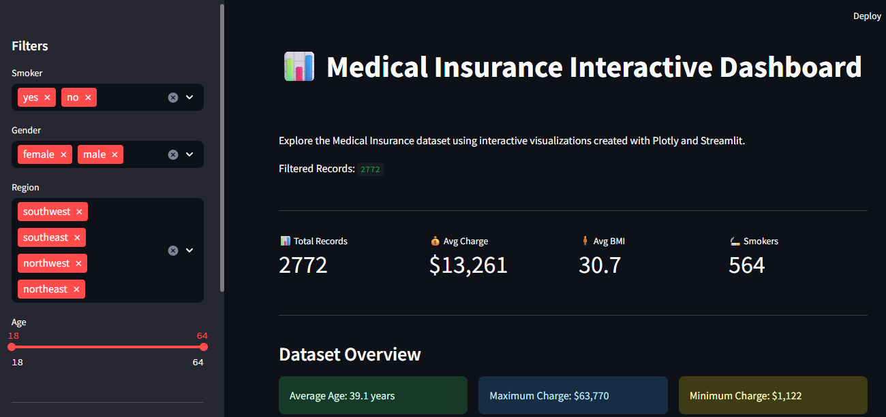
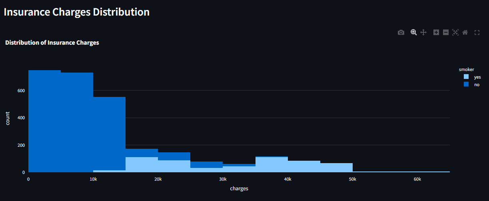
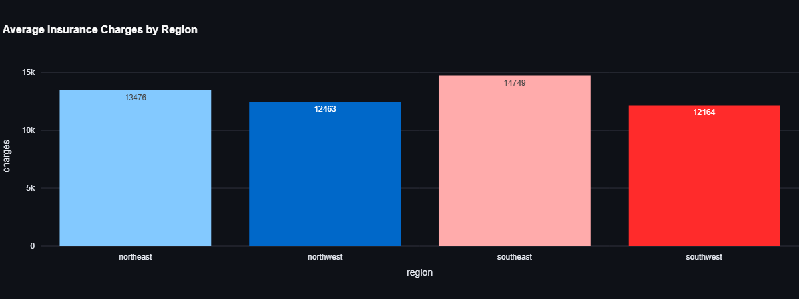
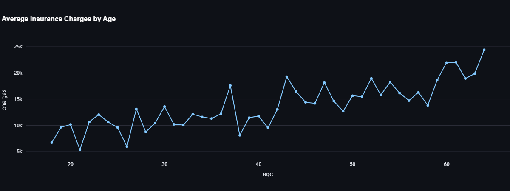
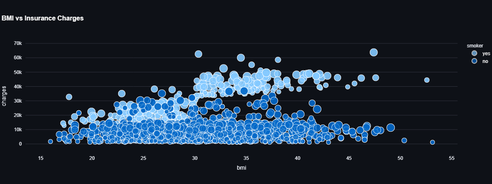
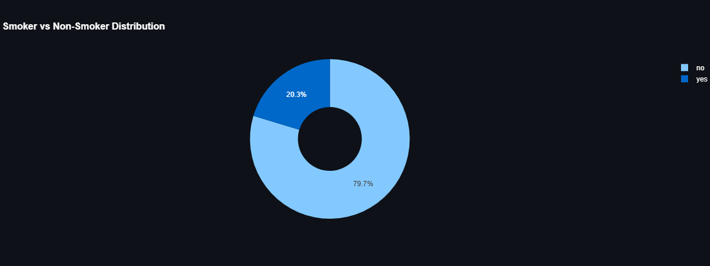
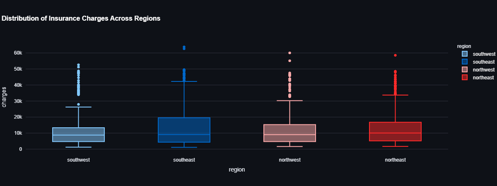
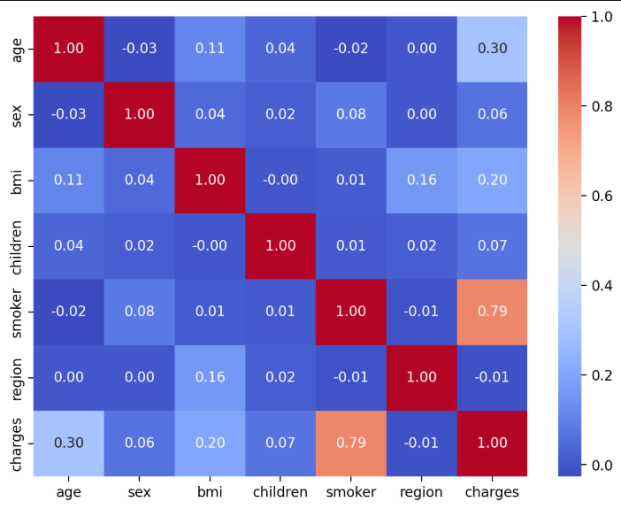
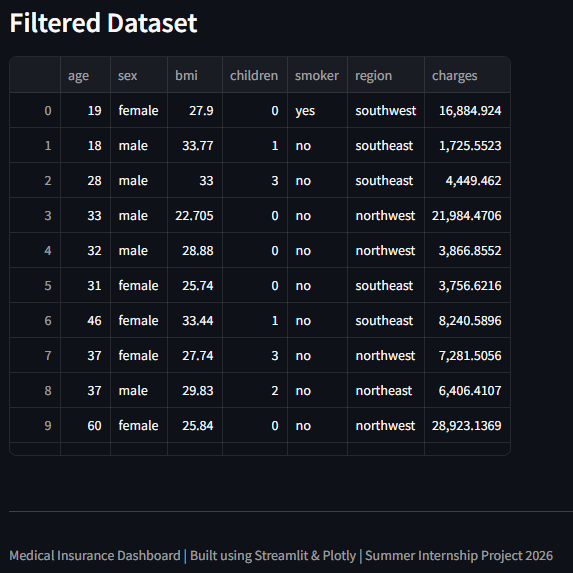

# 🏥 Medical Insurance Interactive Dashboard

An interactive data visualization dashboard built using **Python, Streamlit, and Plotly** to explore the Medical Insurance dataset. The dashboard enables users to analyze insurance charges using dynamic filters and interactive visualizations.

---

## 📌 Project Overview

This project was developed as part of my **Summer Internship 2026**.

The dashboard allows users to:

- Filter data by Age, Gender, Smoker Status, and Region
- Explore insurance charges interactively
- Analyze relationships between medical and demographic features
- View summary statistics
- Explore the filtered dataset in tabular format

---

## 🚀 Live Demo

👉 **Dashboard:** *(Add your Streamlit link here after deployment)*

Example:

https://medical-insurance-dashboard.streamlit.app

---

## 🛠️ Technologies Used

- Python
- Streamlit
- Plotly Express
- Pandas
- NumPy

---

## 📂 Dataset

Medical Insurance Dataset

Features include:

- Age
- Gender
- BMI
- Children
- Smoker
- Region
- Insurance Charges

---

# 📷 Dashboard Preview

## Home Page



---

## Insurance Charges Distribution

Interactive histogram showing the distribution of insurance charges for smokers and non-smokers.



---

## Average Insurance Charges by Region

Compares average insurance costs across different regions.



---

## Average Insurance Charges by Age

Displays how average insurance charges change with age.



---

## BMI vs Insurance Charges

Interactive scatter plot showing the relationship between BMI and insurance charges.



---

## Smoker vs Non-Smoker Distribution

Shows the proportion of smokers and non-smokers in the dataset.



---

## Insurance Charges Across Regions

Interactive box plot comparing insurance charges across all regions.



---

## Correlation Heatmap

Displays the correlation between numerical features.



---

## Filtered Dataset

Interactive table displaying filtered records.



---

## ✨ Features

- Interactive sidebar filters
- Live filtering
- Dynamic visualizations
- KPI cards
- Correlation analysis
- Responsive Streamlit layout
- Dark theme interface

---

## 📁 Project Structure

```
Medical_Insurance_Dashboard/
│
├── app.py
├── insurance.csv
├── requirements.txt
├── README.md
│
└── images/
    ├── home_page.png
    ├── insurance_distribution.png
    ├── region_charges.png
    ├── age_charges.png
    ├── bmi_scatter.png
    ├── smoker_distribution.png
    ├── region_boxplot.png
    ├── correlation_heatmap.png
    └── filtered_dataset.png
```

---

## ▶️ How to Run

Clone the repository

```bash
git clone https://github.com/zaarakhan-dev/Medical-Insurance-Dashboard.git
```

Move into the project directory

```bash
cd Medical-Insurance-Dashboard
```

Install dependencies

```bash
pip install -r requirements.txt
```

Run the Streamlit app

```bash
streamlit run app.py
```

---

## 📈 Key Insights

- Smokers incur significantly higher insurance charges.
- Insurance costs generally increase with age.
- BMI has a moderate positive relationship with insurance charges.
- Southeast region shows the highest average insurance cost.
- Most individuals in the dataset are non-smokers.

---

## 👩‍💻 Author

**Zaara Khan**

B.Tech Computer Science Engineering

Summer Internship Project – 2026

GitHub: https://github.com/zaarakhan-dev

---

⭐ If you found this project helpful, consider giving it a star!
